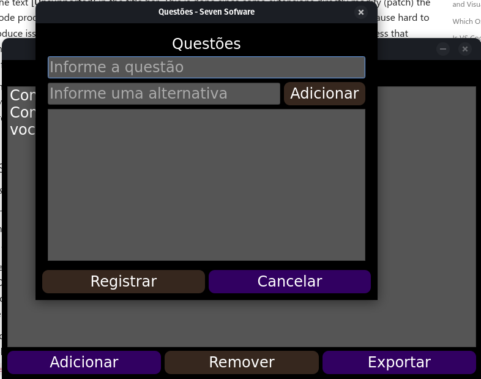
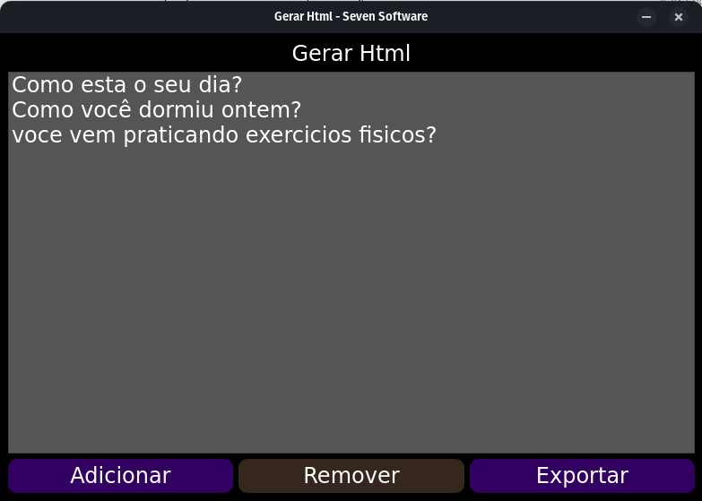

### __Project:__ Generate a HTML file from a markdown file
### __Description:__ This project is a simple python code than generate a file HTML from a file markdown.
### __Author:__ [Gregorio Honorato](https://t.me/greghono)
---
### __How to use:__
1. Type yours questions in the formulate click in __Adicionar__ button.:

2. Just type the question in the text box and click in __Adicionar__ button.
3. Below the text box, you can see the questions that you typed.

4. Just click in __Exportar__ button at window bellow.

5. Choose the file name and the path to save the file.
6. That's it
